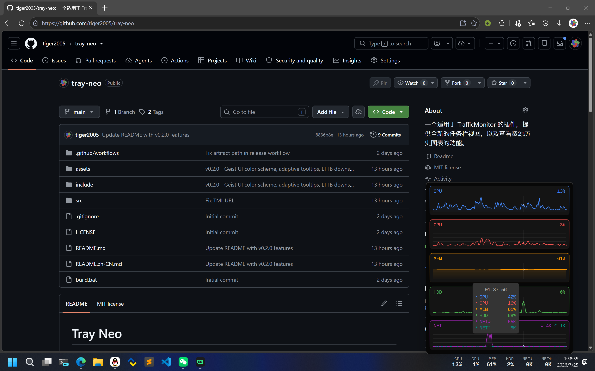
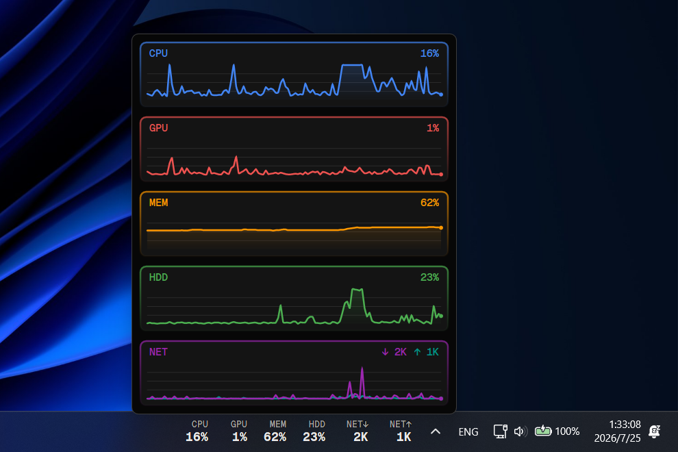
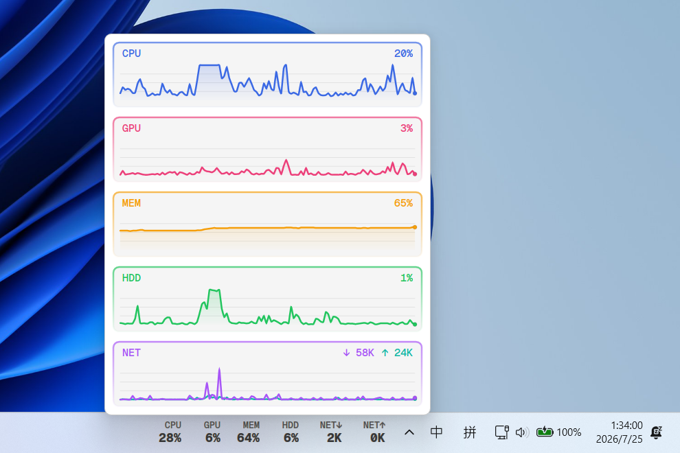
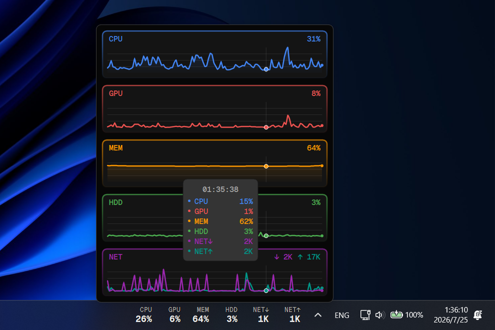

# Tray Neo

[English](README.md)

一个现代化的 TrafficMonitor 插件，在任务栏托盘区域显示实时系统指标，并提供交互式历史图表弹窗。



## 特性

- **实时监控**：CPU、GPU、内存、硬盘、网络（上传/下载）
- **交互式历史图表**：鼠标悬停查看特定时间点的精确数值
- **智能提示框**：三种风格自适应（小型、中型、联动），默认显示在鼠标左侧
- **Geist UI 配色**：基于 Vercel Geist 设计系统的亮色/暗色主题
- **渐变边框**：每个图表的圆角边框使用指标特色色，从顶部向下渐变到透明
- **智能降采样**：历史时长超过 2.5 分钟时，使用 LTTB 算法降采样至 150 个点，保留峰谷特征
- **可配置阈值**：为每个指标配置警告/临界级别
- **切换显示**：点击插件区域显示/隐藏历史图表

## 安装

1. 从 [Releases](https://github.com/tiger2005/tray-neo/releases) 下载最新版本
2. 将 `TrayNeo.dll` 解压到 TrafficMonitor 插件目录：
   - 通常是 `TrafficMonitor\plugins\`
3. 重启 TrafficMonitor
4. 在 TrafficMonitor 设置中启用插件

## 配置

右键点击插件区域，选择"托盘 Neo 设置"：

| 设置项 | 说明 | 默认值 |
|--------|------|--------|
| 历史时长 | 保留历史数据的时间长度（30 秒 ~ 1 小时） | 2 分钟 |
| 任务栏中替换 MAX 为数值 | 达到 100% 时显示实际值而非"MAX" | 关闭 |
| 图表中联动显示数值 | 悬停任意图表时显示所有指标 | 关闭 |

> **注意**：选择 5 分钟及以上的历史时长时，图表会降采样至 150 个数据点（LTTB 算法），因此不保证图表结果的精确性。

### 阈值

配置托盘文字变色的条件：

- **警告阈值**：文字变为橙色
- **临界阈值**：文字变为红色

| 指标 | 警告 | 临界 |
|------|------|------|
| CPU | 70% | 90% |
| GPU | 70% | 90% |
| 内存 | 80% | 95% |
| 硬盘 | 80% | 95% |
| 网络 | 1 MB/s | 5 MB/s |

## 截图

### 深色模式



### 浅色模式



### 历史图表



## 从源码构建

### 环境要求

- Visual Studio 2022（或更高版本）
- Windows SDK 10.0
- MFC（静态库）

### 构建命令

```bash
# 克隆仓库
git clone https://github.com/tiger2005/tray-neo.git
cd tray-neo

# 使用 MSBuild 构建
build.bat
```

生成的 `TrayNeo.dll` 将位于 `Bin/Release/plugins/`（Win32）或 `Bin/x64/Release/plugins/`（x64）。

## 许可证

本项目采用 MIT 许可证 - 详见 [LICENSE](LICENSE)。

## 致谢

- [TrafficMonitor](https://github.com/zhongyang219/TrafficMonitor) - 监控框架
- [tray-pulsy](https://github.com/feelgooder/tray-pulsy) - 灵感来源
- [Geist UI](https://vercel.com/geist/introduction) - 配色方案
- [Geist Mono](https://vercel.com/font) - 插件使用的字体
